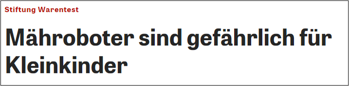
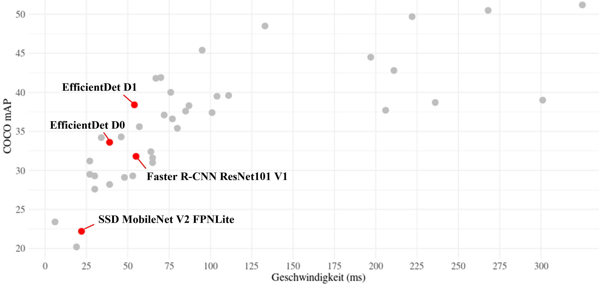
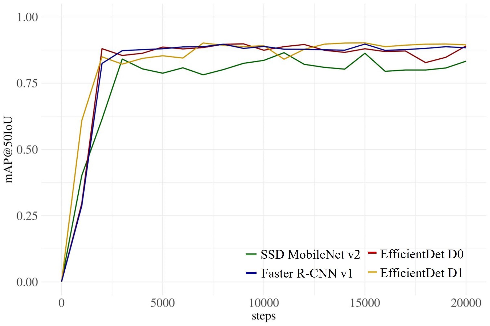
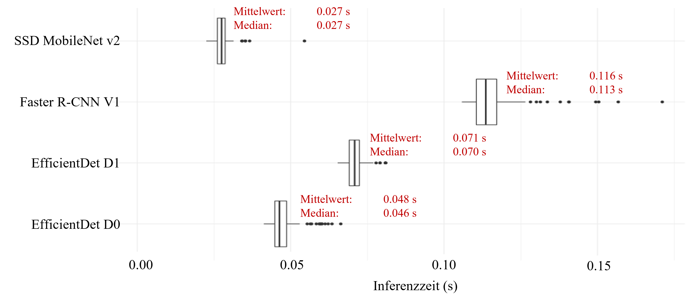

# Erkennung von Kleinkindern bei Rasenrobotern für mehr Sicherheit

Sie sind überall und nicht mehr wegzudenken aus Wohngebieten, Gartenanlagen, Fußballplätzen oder öffentlichen Rasenflächen - die Rasenmähroboter.
Im April 2020 testete Stiftung Warentest elf verschiedene Modelle und kommt zu einem besorgniseregendem Fazit:

 
Quelle: https://www.zeit.de (25.03.2020) 

Kleinkinder, die sich auf dem Rasen befinden, werden durch die Roboter angefahren und im Fuß- und Armbereich verletzt. Alle  Roboter haben zwar Sensoren verbaut, um Hindernisse zu erkennen, jedoch reagieren diese Sensoren im Fall von Kleinkindern erst nach einer gewissen Zeit bzw. einem gewissen Widerstand. In genau dieser Zeit können Verletzungen durch den Rasenmäher ausgelöst werden.

## Objekterkennung mit Tensorflow Object Detection API

Um diese Gefahr zu reduzieren, habe ich auf eine protoypische Objekterkennung entwickelt, die speziell Kleinkinder aus Perspektive des Rasenmährobotersobotors detektiert. Dafür habe ich verschiedene Modelle aus dem Tensorflow Modelzoo (https://github.com/tensorflow/models/blob/master/research/object_detection/g3doc/tf2_detection_zoo.md) verwendet und auf meinen Anwendungsanfall angepasst. Dafür habe ich die vier Modelle ausgewählt und auf den individuellen Anwendungsfall angepasst. 

## Genauigkeit und Rechenzeiten

Die vier ausgewählten Modelle wurden auf die Erkennung von Kleinkindern trainiert und bezüglich Genauigkeit und Inferenzzeit untersucht. 
Mean Average Precision bei IoU-Schwellenwert von 0.5:

Bei den Rechenzeiten ergibt sich der folgende Vergleich: 

## Mobile Echtzeit-Anwendung unter Realbedingungen

Um einen möglichst realistischen Anwendung zu erhalten, habe ich das Modell in das TF-Lite Format exportiert. Dadurch lässt sich eine kamerabasierte Echtzeitanwendung erstellen, die einen Praxiseinsatz bei Rasenroboter realistisch simuliert.

